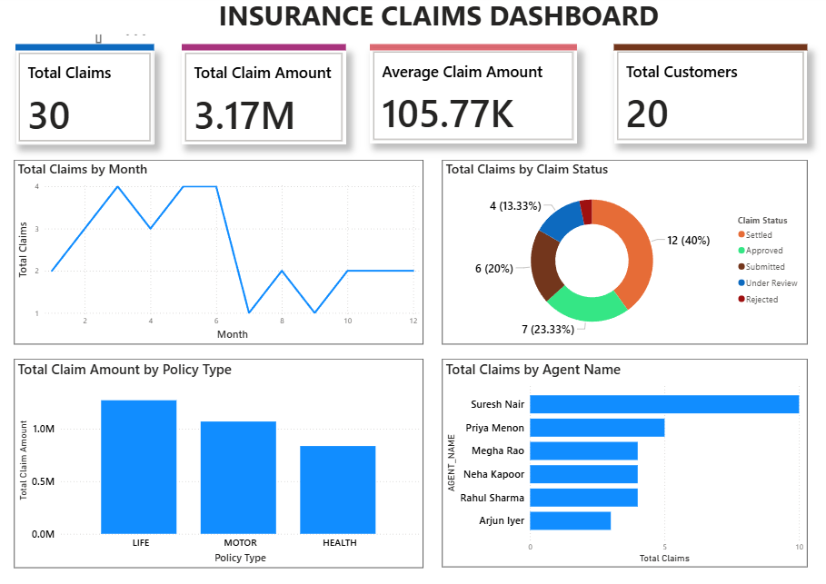

# Insurance Claims Data Warehouse & Analytics Pipeline

An end-to-end data engineering project that builds an automated insurance claims analytics pipeline using **Snowflake, SQL, Change Data Capture (CDC), dimensional modeling, data quality validation, and Power BI**.

The project demonstrates how raw insurance data can be ingested, cleaned, transformed, modeled into a star schema, incrementally processed, validated, and presented through an interactive business intelligence dashboard.

---

## Architecture

```text
CSV Source Files
       |
       v
Snowflake Internal Stage
       |
       v
     RAW Layer
       |
       v
Snowflake Stream (CDC)
       |
       v
Incremental Staging
       |
       v
  Data Validation
     /       \
    /         \
 Valid       Invalid
   |            |
   v            v
FACT_CLAIM   REJECTED_CLAIMS
   |
   v
Dimensional Model
   |
   v
Analytics / Reporting
   |
   v
Power BI Dashboard
```

---

## Technology Stack

- Snowflake
- SQL
- Snowflake Streams
- Snowflake Tasks
- Change Data Capture (CDC)
- Dimensional Modeling
- Power BI
- Git
- GitHub

---

## Data Warehouse Architecture

The Snowflake warehouse follows a three-layer architecture.

### RAW

Stores source data with minimal modification and preserves the original records for traceability.

Main tables:

- `CUSTOMERS`
- `POLICIES`
- `CLAIMS`
- `AGENTS`

### STAGING

Responsible for preparing data for analytical processing.

Transformations include:

- Duplicate removal
- NULL handling
- Text standardization
- Invalid claim filtering
- Incremental record processing
- Data-quality validation
- Rejected-record handling

### ANALYTICS

Contains the dimensional model and reporting objects used by Power BI.

---

## Star Schema

The analytical model uses a star schema with `FACT_CLAIM` at its center.

```text
                    DIM_CUSTOMER
                         |
                         |
DIM_AGENT --------- FACT_CLAIM --------- DIM_POLICY
                         |
                         |
                      DIM_DATE
```

### Fact Table

`FACT_CLAIM`

**Grain:** One row represents one insurance claim.

The fact table contains claim measures and surrogate keys connecting it to the dimensions.

### Dimension Tables

- `DIM_CUSTOMER`
- `DIM_POLICY`
- `DIM_AGENT`
- `DIM_DATE`

Surrogate keys are used in the analytical model to separate warehouse identifiers from source-system business keys.

---

## Data Cleaning and Transformation

The staging layer performs data-quality operations before records reach the analytical model.

Examples include:

- Deduplicating customers and claims using `ROW_NUMBER()`
- Replacing missing city values
- Standardizing categorical fields using `TRIM()` and `UPPER()`
- Detecting invalid or negative claim amounts
- Validating customer and policy references

---

## Change Data Capture and Incremental Loading

The project implements CDC using a **Snowflake Stream** on the RAW claims table.

Instead of repeatedly processing the complete claims dataset, the pipeline captures newly changed records and processes them incrementally.

```text
RAW.CLAIMS
     |
     v
CLAIMS_STREAM
     |
     v
LOAD_CLAIMS_TASK
     |
     v
CLAIMS_INCREMENTAL
```

This reduces unnecessary reprocessing and demonstrates an incremental data-engineering pattern.

---

## Automated Task Pipeline

Snowflake Tasks automate the incremental pipeline.

```text
LOAD_CLAIMS_TASK
        |
        v
REJECT_INVALID_CLAIMS_TASK
        |
        v
LOAD_VALID_CLAIMS_TASK
        |
        v
MARK_PROCESSED_TASK
```

The pipeline automatically:

1. Captures new claim records from the stream.
2. Places them into incremental staging.
3. Identifies and records invalid claims.
4. Loads valid claims into `FACT_CLAIM`.
5. Marks incremental records as processed.

---

## Data Quality and Error Handling

Invalid records are preserved in `REJECTED_CLAIMS` instead of being silently discarded.

Validation includes checks for:

- Missing claim IDs
- Missing claim amounts
- Negative or zero claim amounts
- Unknown customers
- Unknown policies
- Duplicate source records

A rejection reason is stored with invalid records to support troubleshooting and data-quality monitoring.

---

## Snowflake Features Demonstrated

The project uses several Snowflake capabilities:

- Virtual Warehouses
- Databases and Schemas
- Internal Stages
- File Formats
- `COPY INTO`
- Window Functions
- Views
- Streams
- Tasks
- Change Data Capture
- Incremental Loading
- Time Travel
- Zero-Copy Cloning

---

## Analytics

Analytical SQL was developed for:

- Monthly claims trends
- Claims by status
- Claims by policy type
- Claims by agent
- Total claim amounts
- Average claim amounts

A reporting view, `VW_CLAIM_DETAILS`, combines the dimensional model into a business-friendly representation.

---

## Power BI Dashboard

The Snowflake ANALYTICS layer is connected to Power BI using the dimensional model.

The dashboard provides:

- Total Claims
- Total Claim Amount
- Average Claim Amount
- Total Customers
- Claims by Month
- Claims by Status
- Claim Amount by Policy Type
- Claims by Agent



---

## Repository Structure

```text
insurance-claims-snowflake-pipeline/
|
|-- README.md
|
|-- data/
|   |-- customers.csv
|   |-- policies.csv
|   |-- claims.csv
|   `-- agents.csv
|
|-- sql/
|   |-- 01_setup.sql
|   |-- 02_raw_tables.sql
|   |-- 03_staging.sql
|   |-- 04_dimensions.sql
|   |-- 05_fact_claim.sql
|   |-- 06_analytics.sql
|   |-- 07_streams.sql
|   |-- 08_data_quality.sql
|   `-- 09_tasks.sql
|
|-- power_bi/
|   `-- insurance_claims_dashboard.pbix
|
`-- images/
    `-- dashboard.png
```

---

## SQL Execution Order

To recreate the warehouse, execute the SQL files in the following order:

```text
01_setup.sql
02_raw_tables.sql
03_staging.sql
04_dimensions.sql
05_fact_claim.sql
06_analytics.sql
07_streams.sql
08_data_quality.sql
09_tasks.sql
```

Source CSV files must be uploaded to the Snowflake internal stage before the transformation scripts requiring source data are executed.

---

## Key Learning Outcomes

This project demonstrates practical experience with:

- Designing layered data warehouse architectures
- Building fact and dimension tables
- Implementing star schemas
- Writing SQL transformations
- Using window functions for data cleaning
- Implementing CDC
- Building incremental pipelines
- Automating workflows using Snowflake Tasks
- Implementing data-quality and rejection handling
- Connecting a Snowflake warehouse to Power BI
- Building business-facing analytical dashboards